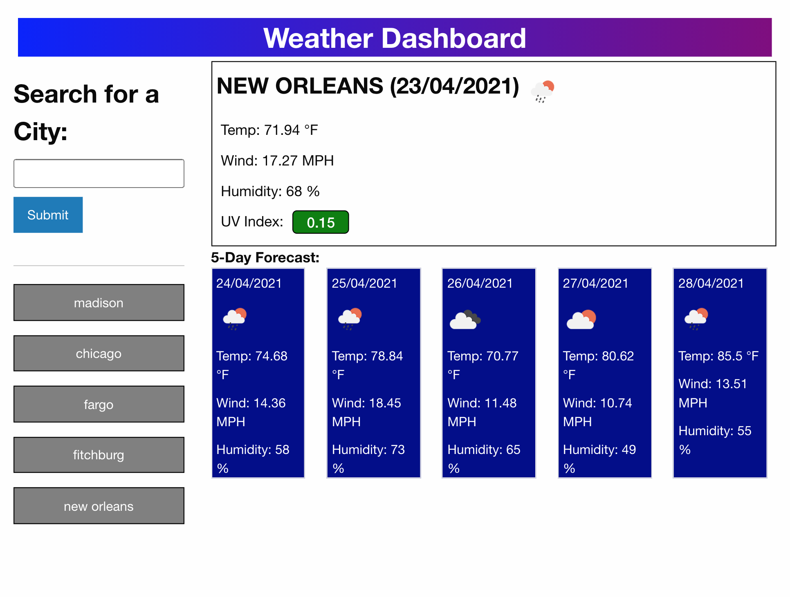
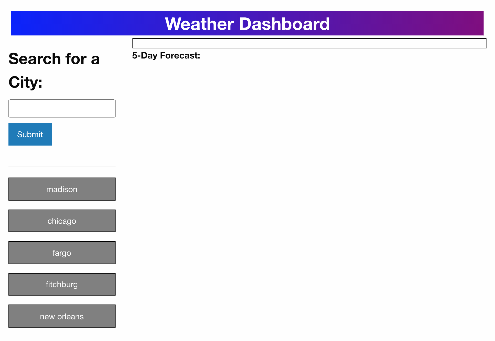

# Weather Dashboard

The weather dashboard is an application that allows the user to search for the weather in a city. Based on the users input the first API call to https://openweathermap.org/ gathers the city's lon and lat, which in turn makes another API call to the same website that gathers the current and future weather. Once a city has been searched, its data is stored in local storage and the city is added as a button below the input box. If an already searched city is clicked then its corresponding data is pulled from local storage instead of making another API call.

## User Story

```
* AS A traveler
* I WANT to see the weather outlook for multiple cities
* SO THAT I can plan a trip accordingly
```

---

## Acceptance Criteria

```
* GIVEN a weather dashboard with form inputs
* WHEN I search for a city
* THEN I am presented with current and future conditions for that city and that city is added to the search history
* WHEN I view current weather conditions for that city
* THEN I am presented with the city name, the date, an icon representation of weather conditions, the temperature, the humidity, the wind speed, and the UV index
* WHEN I view the UV index
* THEN I am presented with a color that indicates whether the conditions are favorable, moderate, or severe
* WHEN I view future weather conditions for that city
* THEN I am presented with a 5-day forecast that displays the date, an icon representation of weather conditions, the temperature, the wind speed, and the humidity
* WHEN I click on a city in the search history
* THEN I am again presented with current and future conditions for that city
```

---

## ScreenShots





---

## Link to Deployed Application

https://allanp94.github.io/06-weather-dashboard/
